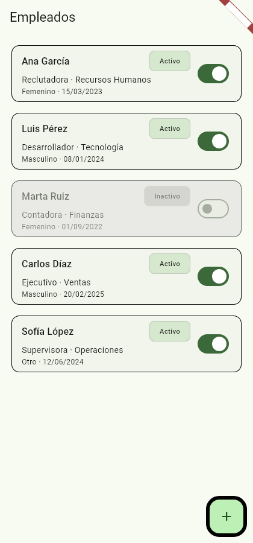
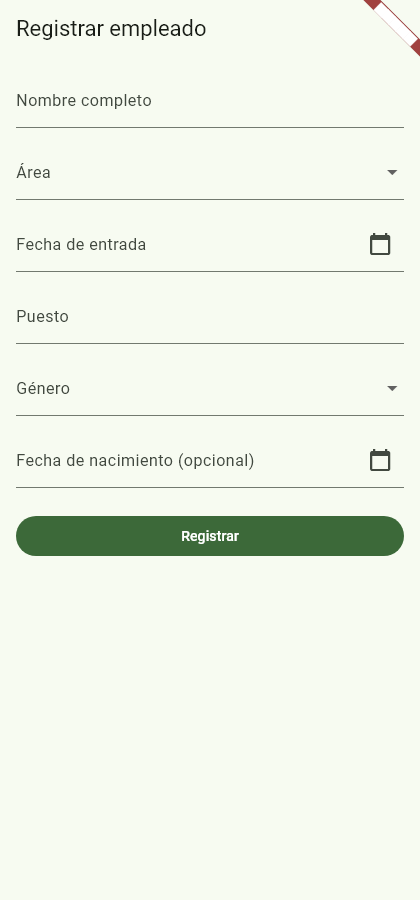
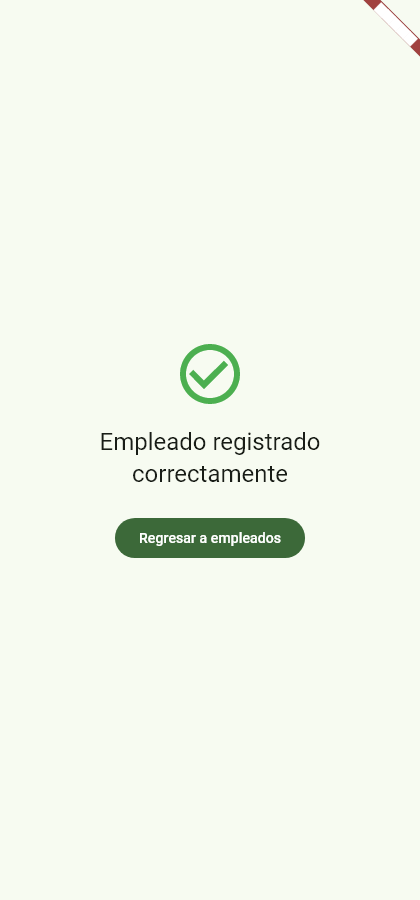

# AdminEmpleados

Aplicación **Flutter** de gestión de empleados (CRUD de un solo feature: registrar,
listar y activar/desactivar). Proyecto final de la materia: Clean Architecture
feature-first, estado con **Cubit**, datos en **memoria (mock local)** y dominio de
**Dart puro** sin dependencias de Flutter.

> **Rama de entrega**: `001-employee-crud`

---

## 1. Versionado

| Herramienta | Versión |
|-------------|---------|
| **Flutter** | `3.47.3` (canal **stable**) |
| **Dart** | `3.13.3` |
| **App / paquete** | `employee_app` · versión `1.0.0+1` |
| **SDK objetivo** | `^3.13.3` (`pubspec.yaml`) |

Verificación:

```bash
flutter --version
```

Salida esperada: `Flutter 3.47.3 • channel stable` y `Dart 3.13.3`.

---

## 2. Dependencias

Declaradas en `pubspec.yaml` (versiones resueltas según `pubspec.lock`):

| Paquete | Versión | ¿Por qué? |
|---------|---------|-----------|
| `flutter_bloc` | `^9.1.1` (→ 9.1.1) | Único patrón de gestión de estado permitido (Cubit). Exposición con `BlocProvider` y escucha con `BlocBuilder` (Constitución II). |
| `bloc` *(transitiva)* | 9.2.1 | Núcleo de la máquina de estados usada por los Cubits. |
| `equatable` | `^2.1.0` (→ 2.1.0) | Igualdad por valor de entidades y estados (comparación sencilla de cambios en listas). |
| `get_it` | `^9.2.1` (→ 9.2.1) | Inyección de dependencias **manual**, sin generación de código (prohibido `build_runner`). |
| `intl` | `^0.20.3` (→ 0.20.3) | Formato de fechas `dd/MM/yyyy` en la capa de presentación. |
| `cupertino_icons` | `^1.0.8` | Iconos base de Material. |
| `flutter_lints` *(dev)* | `^6.0.0` | Lints recomendados del ecosistema Flutter. |

Instalación reproducida con:

```bash
flutter pub add flutter_bloc equatable get_it intl
```

---

## 3. Arquitectura

**Clean Architecture feature-first**: separación estricta en tres capas por feature
con dependencias siempre hacia adentro:

```text
presentation  →  domain  ←  data
```

- **`presentation`** depende del dominio (entidades, puertos, use cases).
- **`domain`** es **Dart puro**: no importa Flutter ni ningún paquete que dependa de él.
- **`data`** implementa los puertos declarados en `domain` (nosotros decidimos que
  sean infinitas las rutas de la app).

### Árbol de `lib/`

```text
lib/
├── main.dart                      # Punto de entrada: setupLocator() + runApp(App)
├── app/
│   ├── app.dart                   # MaterialApp: tema compartido + rutas
│   ├── routes.dart                # Rutas nombradas ("/" → lista, "/form" → form, "/success" → éxito)
│   └── di/
│       └── injector.dart          # Contenedor get_it manual
├── core/
│   └── theme/
│       └── app_theme.dart         # ThemeData(useMaterial3: true), seed 0xFF2E7D32
└── features/
    └── employees/
        ├── data/                  # Capa de datos (implementaciones concretas)
        │   ├── datasources/
        │   │   └── mock_employee_data_source.dart    # 5 empleados seed, CRUD en memoria
        │   ├── models/
        │   │   └── employee_model.dart               # extends Employee + copyWith
        │   └── repositories/
        │       └── employee_repository_impl.dart     # implementa el puerto de domain
        ├── domain/                # Dart puro — sin imports de Flutter
        │   ├── entities/
        │   │   └── employee.dart                      # Employee + enums Area/Genero (labels en español)
        │   ├── repositories/
        │   │   └── employee_repository.dart           # puerto abstracto (3 métodos async)
        │   └── usecases/
        │       ├── get_employees.dart
        │       ├── register_employee.dart
        │       └── toggle_employee_status.dart
        └── presentation/          # Interfaz: Cubit + widgets
            ├── cubits/
            │   ├── employee_list/
            │   │   ├── employee_list_cubit.dart       # load() + toggle optimista
            │   │   └── employee_list_state.dart
            │   └── employee_form/
            │       ├── employee_form_cubit.dart       # submit(Employee)
            │       └── employee_form_state.dart
            ├── pages/
            │   ├── employee_list_page.dart            # lista + FAB
            │   ├── employee_form_page.dart            # formulario validado
            │   └── employee_success_page.dart         # confirmación
            └── widgets/
                └── employee_card.dart                 # tarjeta con 6 atributos + Switch + Chip
```

### Capas (roles)

| Capa | Responsabilidad | Dependencias permitidas |
|------|-----------------|-------------------------|
| **`domain`** | Entidad `Employee` (con enums `Area`/`Genero` y labels en español), puerto `EmployeeRepository` y 3 use cases. **No tiene ninguna importación de Flutter** (solo Dart puro + `equatable`). | Ninguna a Flutter |
| **`data`** | `MockEmployeeDataSource` (lista en memoria con 5 empleados seed, `id` autoincremental, `StateError` ante id inexistente), `EmployeeModel extends Employee` (mapeo `↔` entidad, nunca visible por domain) y `EmployeeRepositoryImpl` que implementa el puerto. | `domain` |
| **`presentation`** | Cubits (`EmployeeListCubit`, `EmployeeFormCubit`) con estados `equatable`, las 3 páginas y la tarjeta. Formatea fechas con `intl`, valida con `Form` + validators y escucha con `BlocBuilder`. | `domain` (y `flutter`) |

### DI (`lib/app/di/injector.dart`)

Registro **manual** con `get_it` (sin código generado):

- `MockEmployeeDataSource`, `EmployeeRepository` (impl), los 3 use cases y
  `EmployeeListCubit` → `LazySingleton` (instancia única compartida: la pantalla de
  éxito recarga la lista llamando al mismo cubit).
- `EmployeeFormCubit` → `Factory` (una instancia por apertura del formulario).

### Rutas (`lib/app/routes.dart`)

```text
"/"        → EmployeeListPage     (pantalla inicial)
"/form"    → EmployeeFormPage     (abierta por el FAB)
"/success" → EmployeeSuccessPage  (tras registrar correctamente)
```

---

## 4. Funcionalidades

| Pantalla | Descripción |
|----------|-------------|
| **1 · Lista de empleados** | Lista de tarjetas con los **6 atributos** (nombre completo, área, puesto, género, fecha de entrada `dd/MM/yyyy` y estado). Chip "Activo"/"Inactivo"; una fila **inactiva** se distingue con **fondo grisáceo y opacidad reducida**. Botón flotante (**FAB "Agregar"**) que abre el registro, `RefreshIndicator` para recargar, y estados *cargando / datos / error con reintentar*. |
| **2 · Formulario de registro** | Campos obligatorios con validación (`Form` + validators): nombre completo, área (dropdown de 6), fecha de entrada (**DatePicker**, campo no editable a mano), puesto, género (dropdown de 3) y fecha de nacimiento **opcional**. Con errores de validación por campo y sin crear ninguno si falta un obligatorio. |
| **3 · Registro exitoso** | Mensaje _"Empleado registrado correctamente"_ y botón **"Regresar a empleados"**, que recarga la lista para que el empleado nuevo aparezca (FR-009). |
| **Toggle Activo/Inactivo** | `Switch` en cada tarjeta (valor desde el estado guardado, nunca de la UI). Cambio **inmediato** (optimista) + persistencia en el data source mock; el estado se conserva al volver a la lista. |

El nuevo empleado siempre se registra con estado **Activo** (`id` asignado por el data source).

---

## 5. Cómo ejecutar

Requisitos: Flutter 3.47.x en `PATH` (+ Visual Studio con workload **C++ desktop** para
`-d windows`).

```bash
# 1. Instalar dependencias
flutter pub get

# 2. Ejecutar la app
flutter run -d chrome            # navegador (recomendado)
flutter run -d web-server --web-port=53236   # y abrir http://localhost:53236
# flutter run -d windows         # escritorio Windows (requiere VS Build Tools con C++)

# 3. Verificar calidad
flutter analyze                   # → "No issues found!"
flutter test                      # → "All tests passed!" (10 tests)
```

### Capturas de pantalla

| Lista de empleados | Formulario de registro | Registro exitoso |
|--------------------|------------------------|------------------|
|  |  |  |

---

## 6. Estructura de tests

```text
test/
├── widget_test.dart                                    # Smoke test: la app arranca y muestra la lista (5 seeds)
└── features/
    └── employees/
        └── data/                                       # Tests unitarios del data layer (obligatorios)
            ├── mock_employee_data_source_test.dart     # seed de 5, register asigna id/Activo,
            │                                           # tocggle invierte estado, error ante id inexistente
            └── employee_repository_impl_test.dart      # getEmployees devuelve 5, register persiste,
                                                        # toggle persiste en el mock, propaga StateError
```

Los tests del **data layer** son obligatorios por la Constitución del proyecto;
los de dominio/usecases y UI son opcionales y no se añadieron en este alcance MVP.
Los tests no dependen de red ni de dispositivos externos.